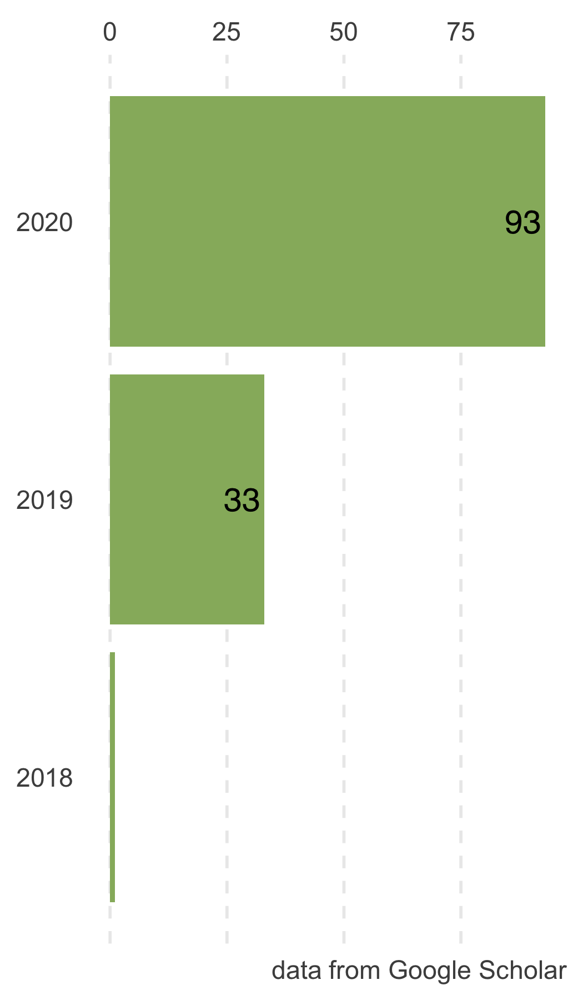

```{r, include=FALSE}
knitr::opts_chunk$set(
  results='asis', 
  echo = FALSE
)


# CRANpkg <- function (pkg) {
#     cran <- "https://CRAN.R-project.org/package"
#     fmt <- "[%s](%s=%s)"
#     sprintf(fmt, pkg, cran, pkg)
# }
# 
# Biocpkg <- function (pkg) {
#     sprintf("[%s](http://bioconductor.org/packages/%s)", pkg, pkg)
# }

library(glue)
library(tidyverse)

# Set this to true to have links turned into footnotes at the end of the document
PDF_EXPORT <- FALSE

# Holds all the links that were inserted for placement at the end
links <- c()

find_link <- regex("
  \\[   # Grab opening square bracket
  .+?   # Find smallest internal text as possible
  \\]   # Closing square bracket
  \\(   # Opening parenthesis
  .+?   # Link text, again as small as possible
  \\)   # Closing parenthesis
  ",
  comments = TRUE)

sanitize_links <- function(text){
  if(PDF_EXPORT){
    str_extract_all(text, find_link) %>% 
      pluck(1) %>% 
      walk(function(link_from_text){
        title <- link_from_text %>% str_extract('\\[.+\\]') %>% str_remove_all('\\[|\\]') 
        link <- link_from_text %>% str_extract('\\(.+\\)') %>% str_remove_all('\\(|\\)')
        
        # add link to links array
        links <<- c(links, link)
        
        # Build replacement text
        new_text <- glue('{title}<sup>{length(links)}</sup>')
        
        # Replace text
        text <<- text %>% str_replace(fixed(link_from_text), new_text)
      })
  }
  
  text
}


# Takes a single row of dataframe corresponding to a position
# turns it into markdown, and prints the result to console.
build_position_from_df <- function(pos_df){
  
  missing_start <- pos_df$start == 'N/A'
  dates_same <- pos_df$end == pos_df$start
  if (pos_df$end == 9999) {
    pos_df$end = "present"
  }
  if(any(c(missing_start,dates_same))){
    timeline <- pos_df$end
  } else {
    timeline <- glue('{pos_df$end} - {pos_df$start}')
  }

  descriptions <- pos_df[str_detect(names(pos_df), 'description')] %>% 
    as.list() %>% 
    map_chr(sanitize_links)
  
  # Make sure we only keep filled in descriptions
  description_bullets <- paste('-', descriptions[descriptions != 'N/A'], collapse = '\n')
  
  if (length(description_bullets) == 1 && description_bullets == "- ") {
    description_bullets <- ""
  }
  glue(
"### {sanitize_links(pos_df$title)}

{pos_df$loc}

{pos_df$institution}

{timeline}

{description_bullets}


"
  ) %>% print()
}

# Takes nested position data and a given section id 
# and prints all the positions in that section to console
print_section <- function(position_data, section_id){
  x <- position_data %>% 
    filter(section == section_id) %>% 
    pull(data) 
  
  prese <- " - "
  xx <- list()

  for (i in seq_along(x)) {    
      y = x[[i]]
      y <- cbind(y, start2 = as.character(y$start))
      y <- cbind(y, end2 = as.character(y$end))

      se <- paste(y$start, "-", y$end, collapse = " ")
      if (prese == se) {
        y$start2 = ""
        y$end2 = ""
      } else {
        prese = se
      }

    xx[[i]] <- select(y, -c(start, end)) %>%
      rename(start=start2, end=end2)
  }
    
  xx %>% 
    purrr::walk(build_position_from_df)
}


fill_nas <- function(column){
  ifelse(is.na(column), 'N/A', column)
}

# Load csv with position info
position_data <- read_csv(position_path) %>% 
  mutate_all(fill_nas) %>% 
  arrange(order, desc(end)) %>% 
  mutate(id = 1:n()) %>% 
  nest(data = c(-id, -section))
```

```{r}
# When in export mode the little dots are unaligned, so fix that. 
if(PDF_EXPORT){
  cat("
  <style>
  :root{
    --decorator-outer-offset-left: -6.5px;
  }
  </style>")
}
```

Aside
================================================================================


{width=100%}

```{r}
# When in export mode the little dots are unaligned, so fix that. 
# if(PDF_EXPORT){
#   cat("View this CV online with links at _guangchuangyu.github.io/cv_")
# }
```

Contact {#contact}
--------------------------------------------------------------------------------

- <i class="fa fa-envelope"></i> w_shixiang@163.com
- <i class="fa fa-twitter"></i> @WangShxiang
- <i class="fa fa-github"></i> github.com/Shixiang Wang
- <i class="fa fa-link"></i> ShixiangWang.github.io
- <i class="fa fa-weixin"></i> elegant-r


Selected tools {#skills}
--------------------------------------------------------------------------------

Bioinformatics

- [sigminer](https://github.com/ShixiangWang/sigminer)
- [sigflow](https://github.com/ShixiangWang/sigflow)
- [ezcox](https://github.com/ShixiangWang/ezcox)
- [metawho](https://github.com/ShixiangWang/metawho)
- [UCSCXenaTools](https://github.com/ropensci/UCSCXenaTools)
- [UCSCXenaShiny](https://github.com/openbiox/UCSCXenaShiny)
- [DoAbsolute](https://github.com/ShixiangWang/DoAbsolute)
- [IDConverter](https://github.com/ShixiangWang/IDConverter)
- [neopeptides](https://github.com/ShixiangWang/neopeptides)
- [install_GISTIC](https://github.com/ShixiangWang/install_GISTIC)

Fun

- [tinyscholar](https://github.com/ShixiangWang/tinyscholar)
- [contribution](https://github.com/ShixiangWang/contribution)
- [loon](https://pypi.org/project/loon/)
- [R search extension](https://github.com/ShixiangWang/r-search-extension)
- [flymaps](https://github.com/ShixiangWang/flymaps)

Disclaimer {#disclaimer}
--------------------------------------------------------------------------------

Last updated on `r Sys.Date()`.

Main
================================================================================

Shixiang Wang {#title}
--------------------------------------------------------------------------------

PhD student of Bioinformatics at [Xue-Song Liu lab](https://github.com/XSLiuLab), [ShanghaiTech University](https://www.shanghaitech.edu.cn/), currently working on cancer genomics and immunotherapy biomarker by biostatistic skills.
I am a fan of R (particularly), Python and Golang. I love open source and open science.
I have developed many R package and shared much experience about coding and data analysis on many platforms.

For some details,

- I have advanced experience in using R and Shell for data preprocessing, data cleaning and data interpretation.
- I have moderate experience in using R for statistical modeling and data visualization.
- I master developing pure R packages and have a little experience in Python package, R Shiny and Rcpp development.
- I can combine multiple programming languages/tools to create analysis pipeline. I know how to use Docker to package analysis environment and enhance reproducible research.
- I can process raw genomic data and analyze them. I have moderate experience in somatic variant calling (including SNV, INDEL and CNV), differential expression analysis and enrichment analysis.
- I know how to do machine learning (including deep learning) and have applied some technologies to my projects.
- I like to write with R Markdown (including Markdown) and share my knowledge to others in many ways.
- I love to contribute open-source scientific tool development (e.g. [maftools](https://github.com/PoisonAlien/maftools), [forestmodel](https://github.com/NikNakk/forestmodel/)).
- Last not but least, I enjoy learning and researching.


Education {data-icon=graduation-cap data-concise=true}
--------------------------------------------------------------------------------

```{r, results='asis', echo = FALSE}
print_section(position_data, 'education')
```

\newpage
Publications {data-icon=book}
--------------------------------------------------------------------------------

::: aside

```{r}
  glue(

"
+ Citation = {profile$total_cites}
+ H-index = {profile$h_index}
+ I10-index = {profile$i10_index}

"
  ) %>% print()

```


:::


```{r}
print_section(position_data, 'academic_articles')
```


Conference proceedings {data-icon=group}
--------------------------------------------------------------------------------

```{r}
print_section(position_data, 'presentation')
```
